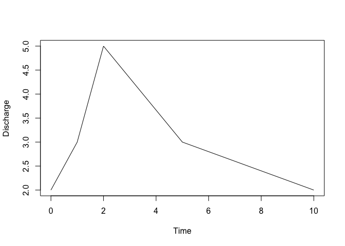
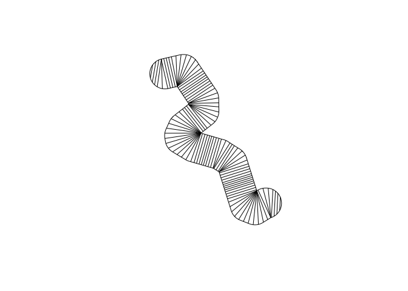
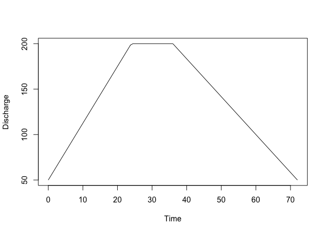

<!-- README.md is generated from README.Rmd. Please edit that file -->

# gbem

<!-- badges: start -->

[](https://lifecycle.r-lib.org/articles/stages.html#experimental)
[](https://CRAN.R-project.org/package=gbem)
[](https://github.com/stochaGBEM/gbem/actions/workflows/R-CMD-check.yaml)
[](https://app.codecov.io/gh/stochaGBEM/gbem?branch=main)
<!-- badges: end -->

The goal of gbem is to calculate erosion volumes expected at a river’s
cross section, given flow magnitude and duration.

## Installation

As gbem is not on CRAN, you can install it from GitHub by running the
following command in R:

``` r
remotes::install_github("stochaGBEM/gbem")
```

If this doesn’t work, you may have to install the remotes package with
the command `install.packages("remotes")`.

## Example

``` r
library(gbem)
```

### Hydrographs

Make a hydrograph from scratch:

``` r
hg <- hydrograph(
  2 ~ 0, 3 ~ 1, 5 ~ 2, 3 ~ 5, 2 ~ 10
)
plot(hg)
```



Or, from a data frame; this time, also specify a time multiplier:

``` r
data.frame(times = c(0, 1 / 3, 1), flow = c(100, 500, 200)) |> 
  as_hydrograph(times_from = times, flows_from = flow, unit = 24) |> 
  plot()
```



There are canned hydrographs for snowmelt-related and rainfall-related
events, too:

``` r
hydrograph_rain(peak = 200, baseflow = 50) |> 
  plot()
```


``` r
hydrograph_snow(peak = 200, baseflow = 50) |> 
  plot()
```



You can easily discretize the hydrograph if you’d like to do manual
calculations:

``` r
discretize_hydrograph(hg, 10)
#> # A tibble: 10 × 2
#>     time  flow
#>    <dbl> <dbl>
#>  1  0     2   
#>  2  1.11  3.22
#>  3  2.22  4.85
#>  4  3.33  4.11
#>  5  4.44  3.37
#>  6  5.56  2.89
#>  7  6.67  2.67
#>  8  7.78  2.44
#>  9  8.89  2.22
#> 10 10     2
```

### Cross Sections

Make a channel cross section:

``` r
cs <- cross_section(width = 3, grad = 0.01, d50 = 0.1, d84 = 0.5, roughness = 0.01)
cs
#> Channel with width 3
```

### Gravel-bed river bank erosion model

Execute the algorithm for a constant flow by running `gbem()`. That
returns a gbem object containing information about channel changes. Run
`erode()` to execute the changes to get a new cross section:

``` r
g1 <- gbem(100, t = 1, cross_section = cs)
erode(g1)
#> Channel with width 299.403582260773
```

You can also iterate GBEM across a hydrograph.

``` r
g2 <- gbem2(hg, cross_section = cs, niter = 100)
erode(g2)
#> Channel with width 23.4198648991414
```
